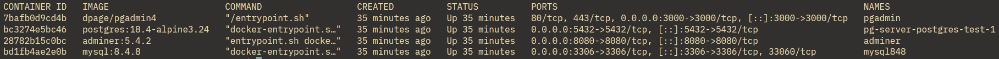

# dbs_docker_env

Ambiente Docker com n8n + PostgreSQL. Minha primeira experiência real com automação de workflow e uso de IA via API. 

## Motivos

Uma pipeline do apache Aiflow terminava um processo sem um aviso/notificação.
Queria que, a partir de webhook, o n8n avisasse que um relatório estava pronto
e usasse IA para transformar/formatar os dados antes de enviar uma versão reduzida por e-mail.

## Resumo e Problemas

- n8n é ótimo para orquestrar esse tipo de fluxo (webhook -> processamento -> notificação) sem escrever tudo à mão.
- Tentei rodar Python puro dentro do container do n8n e não deu certo (n8n é Node.js
  por natureza) — contornei fazendo essa parte fora, no próprio pipeline de origem.
- Ainda é um fluxo básico, não chegou a rodar em produção — mas validou a ideia.

## Ambiente (Docker)

### Subir o ambiente Docker
```bash
docker compose build
docker compose up -d 
```

### Comandos Docker úteis
```bash
docker compose down                  # para parar o ambiente mantendo os volumes
docker compose down -v ou --volumes  # para o ambiente e remove os volumes
docker ps                            # containers rodando
docker logs <containerId>            # debug
``` 
## Notas

O container do mysql na primeira vez que ele for criado uma tabela `users`vai ser criada para facilitar no start com os bancos.


`mysql:`
- user: root
- password: root
- port: 3306
 
`adminer:`
- https://localhost:8080

`postgresql:`
  - user: postgres
  - password: root
  - port: 5432
  - 
`pgadmin:`
  - localhost:3000

## Praticidade com seu Ambiente

Adicionei dois scritps de shell básicos, para ficar mais prático subir e descer todos os serviços. Caso você tenha algum problema com os containers/volumes você terar que recorrer diretamente ao docker. Os comandos **prune** sempre ajudam.

- `up.sh`
- `down.sh`

Executando:

```bash 
  ./up.sh
  ./down.sh
  bash up.sh
  bash down.sh
``` 

Se tudo der certo:




---

Vamos trocar uma ideia no LinkedIn:

[LinkedIn](https://www.linkedin.com/in/felipepinheiro2/)

---
